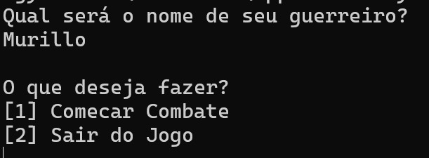
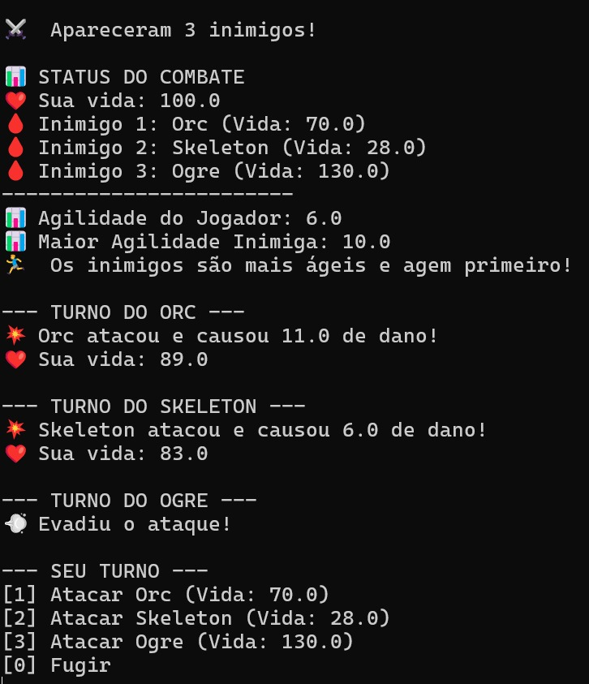
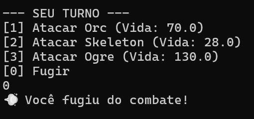
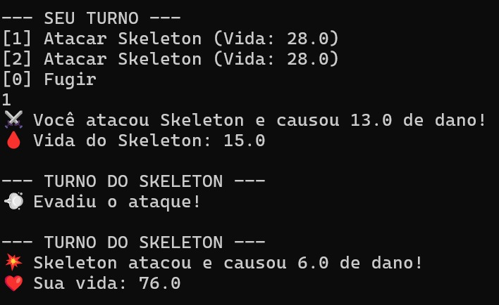
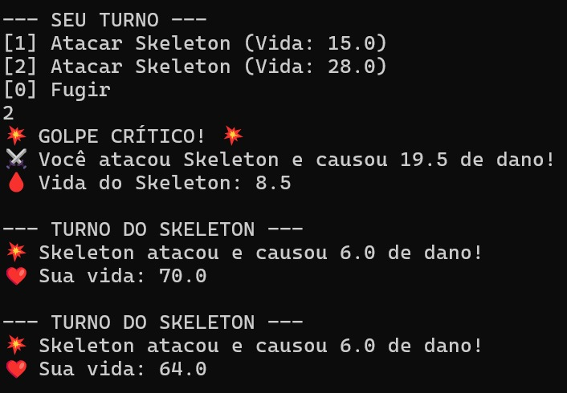
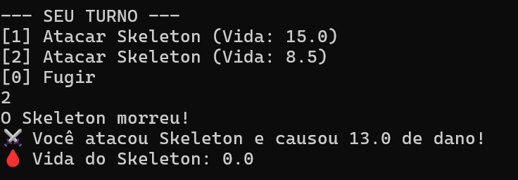
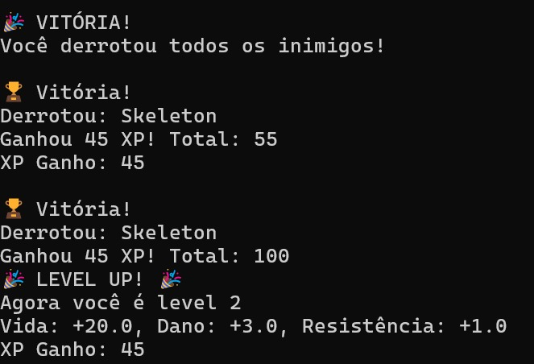
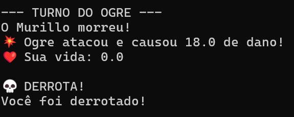

# 🗡️ Tiny RPG

Um RPG em terminal desenvolvido em Swift como parte do Apple Academy. O jogador controla um guerreiro que enfrenta inimigos em combates por turnos, ganha experiência, sobe de nível e evolui seus atributos.

## 📸 Screenshots do Jogo

### Menu Inicial
O jogo inicia pedindo o nome do seu guerreiro e apresenta as opções principais.



**Código relacionado:**
```swift
public func StartGame() {
    print("Qual será o nome de seu guerreiro? ");
    let nome : String = readLine() ?? "";
    
    while !hasTheGameEnded {
        let (character, equipment) = createPlayer(name: nome);
        let player : Player = Player(
            xp: 10,
            characterData: character,
            equipmentData: equipment
        );
        
        print("O que deseja fazer?")
        let options = [
            "[1] Comecar Combate",
            "[2] Sair do Jogo"
        ];
        
        let menu = Menu(options: options);
        let chosenOption = menu.getChosenOption();
    }
}
```

### Sistema de Combate com Múltiplos Inimigos
O jogo gera aleatoriamente de 1 a 4 inimigos por combate. O sistema determina automaticamente quem ataca primeiro baseado na agilidade.



**Código relacionado:**
```swift
public func startCombat() {
    let count = Int.random(in: 1...4);
    Enemies.removeAll();
    for _ in 0..<count {
        let enemy = enemyFactory.createRandomEnemy();
        Enemies.append(enemy);
    }
    
    print("\n⚔️  Apareceram \(Enemies.count) inimigos!");
    showCombatStatus();
    
    let playerGoesFirst = determineFirstTurn();
    Player.isCharacterTurn = playerGoesFirst;
}
```

### Opção de Fuga
O jogador pode escolher fugir do combate a qualquer momento durante seu turno.



**Código relacionado:**
```swift
private func playerTurn() {
    print("\n--- SEU TURNO ---");
    for i in 0..<Enemies.count {
        let enemy = Enemies[i];
        if enemy.Life > 0 {
            print("[\(i+1)] Atacar \(enemy.characterData._name) (Vida: \(enemy.Life))");
        }
    }
    print("[0] Fugir");
    
    let input = readLine() ?? "";
    let option = Int(input) ?? -1;
    
    if option == 0 {
        print("💨 Você fugiu do combate!");
        hasCombatEnded = true;
        return;
    }
}
```

### Ataques e Dano
O sistema de combate mostra claramente os ataques realizados e o dano causado.



**Código relacionado:**
```swift
private func playerAttack(target: Enemy) {
    let playerDamage = Player.giveDamage();
    do {
        let finalDamage = try target.receiveDamage(damage: playerDamage);
        if finalDamage > 0 {
            target.takeDamage(finalDamage);
            print("⚔️ Você atacou \(target.characterData._name) e causou \(finalDamage) de dano!");
            print("🩸 Vida do \(target.characterData._name): \(target.Life)");
        }
    } catch {
        print("❌ Erro no seu ataque: \(error)");
    }
}
```

### Golpes Críticos
O jogo possui um sistema de golpes críticos que causa dano extra baseado no atributo de crítico do jogador.



**Código relacionado:**
```swift
override func giveDamage() -> Float {
    let baseDamage = super.giveDamage();
    let criticalChance = characterData._critical + equipmentData._helmet.critical;
    let criticalRoll = Float.random(in: 0...100);
    
    if criticalRoll <= criticalChance {
        print("💥 GOLPE CRÍTICO! 💥");
        return baseDamage * 1.5;
    }
    
    return baseDamage;
}
```

### Inimigos Derrotados
Quando um inimigo é derrotado, sua vida chega a zero e ele não pode mais atacar.



### Sistema de XP e Level Up
Ao derrotar inimigos, o jogador ganha XP e pode subir de nível, melhorando seus atributos.



**Código relacionado:**
```swift
func giveRewards(_ player: Player, for enemy: Enemy) -> Float {
    let baseXP: Float = 45;
    let xpGained = baseXP * enemy.characterData._level;
    
    player.gainXP(xpGained);
    print("Ganhou \(xpGained) XP! Total: \(player.XP)");
    
    return xpGained;
}

func gainXP(_ amount: Float) {
    XP += amount;
    
    let xpNeeded = Float(characterData._level * 100);
    if XP >= xpNeeded {
        levelUp();
    }
}

private func levelUp() {
    characterData._level += 1;
    print("🎉 LEVEL UP! 🎉");
    print("Agora você é level \(characterData._level)");
    
    let lifeGain: Float = 20.0;
    let damageGain: Float = 3.0;
    let resistanceGain: Float = 1.0;
    
    characterData._life += lifeGain;
    characterData._damage += damageGain;
    characterData._resistance += resistanceGain;
    
    print("Vida: +\(lifeGain), Dano: +\(damageGain), Resistência: +\(resistanceGain)");
}
```

### Game Over
Se a vida do jogador chegar a zero, o jogo termina com uma tela de derrota.



**Código relacionado:**
```swift
private func endCombat() {
    if Player.Life <= 0 {
        print("\n💀 DERROTA!");
        print("Você foi derrotado!");
        print("");
    } else if !Enemies.contains(where: { $0.Life > 0 }) {
        print("\n🎉 VITÓRIA!");
        print("Você derrotou todos os inimigos!");
        // ... recompensas
    }
    hasCombatEnded = true;
}
```

## 🔧 Tecnologias Utilizadas

- **Swift 6.2**
- **Programação Orientada a Objetos**
- **Pattern Factory**
- **Error Handling com do/catch**
- **Input e Optional Handling**

## 👨‍💻 Autor

**Murillo Gomes Yonamine**  
Projeto desenvolvido como parte do Apple Academy 2025